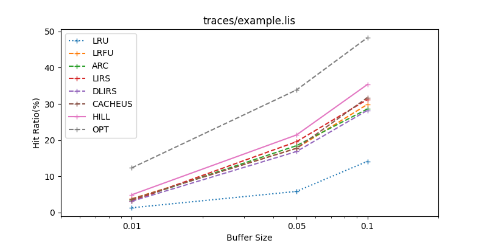

# Hill-Cache

Here we provide a Hill-cache prototype and benchmarks for evaluating Memcached and MemHC.

We have also implemented Hill-Cache in [MemHC](https://github.com/liyunfan1223/MemHC) and [RocksHill](https://github.com/liyunfan1223/RocksHill).

## Prototype

The prototype is used to verify and compare the hit rate performance of the cache polices. We implemented varies cache policies and compared the hit rate difference with hill-cache under the condition of global synchronization cache.

### Build
```
mkdir build
cd build
cmake ..
make proto
```

### Usage
```
./bin/proto -h
Usage: ./proto [options]
Options:
  -h, --help             Show this help message
  -c, --cache-policy     Cache policy (LRU, LFU, ARC, SRRIP, DRRIP, LRFU, LIRS, DLIRS, CACHEUS, S3FIFO, HILL, OPT)
  -b, --buffer-size      Buffer size (decimal represents the ratio to the footprint, integer represents the size)
  -t, --trace-file       Trace file path
  -s, --stats-interval   Statistics reporting interval
```

### Example
```
./bin/proto -c HILL -b 0.1 -t ../traces/example.lis -s 50000
Hill-Cache: buffer_size:30994 hit_count:643989 miss_count:1177420 hit_rate:35.3566%
```

### Traces

- [CloudVPS Traces](https://visa.lab.asu.edu/web/resources/traces/traces-cloudvps/)
- [FIU Traces](http://iotta.snia.org/traces/block-io/414)
- [MSR Cambridge Traces](http://iotta.snia.org/traces/block-io/388)
- [SQL Server Traces](http://iotta.snia.org/traces/block-io/130)

### Scripts

**Installation**
```
pip install -r requirement.txt
```
**Runner**
```
python ./scripts/prototype/runner.py
```
**Visualization**



Check output figure in local/runner_example.png

**Configuration**

Check scripts/config.py to configure parameters for prototype running.


## Benchmark

### Installation

For memtier bench, you need to install [memtier_benchmark](https://github.com/RedisLabs/memtier_benchmark) first.

For web application bench, you need to install libraries of [rocksdb](https://rocksdb.org/) and [libmemcached](https://libmemcached.org/libMemcached.html).

For both benchmarks, you need to install [MemHC](https://github.com/liyunfan1223/MemHC) and [Memcached](https://github.com/memcached/memcached) and place the executable files under the path specified in configuration.

After installation, compile the benchmark target of this project
```
make bench
```

### Memtier_benchmark Scripts

A benchmark that uses memtier_benchmark to test concurrent memory access throughput and latency.

```
python scripts/benchmark/memtier.py
```
A benchmark that simulates testing network application.

**Set config_memtier in config.py for configuration settings**.

Example result (default in local/memtier.log):
```
mem-64 memc_executable-./local/memcached threads-16 server_thread-8
Type         Ops/sec     Hits/sec   Misses/sec    Avg. Latency     p50 Latency     p99 Latency   p99.9 Latency       KB/sec 
----------------------------------------------------------------------------------------------------------------------------
Sets       200202.55          ---          ---         0.04088         0.03900         0.11900         0.31100    208967.47 
Gets       200202.55    169770.93     30431.62         0.03883         0.03900         0.11100         0.26300      7200.77 
Waits           0.00          ---          ---             ---             ---             ---             ---          --- 
Totals     400405.11    169770.93     30431.62         0.03986         0.03900         0.11100         0.27900    216168.23 

mem-64 memc_executable-./local/memhc threads-16 server_thread-8
Type         Ops/sec     Hits/sec   Misses/sec    Avg. Latency     p50 Latency     p99 Latency   p99.9 Latency       KB/sec 
----------------------------------------------------------------------------------------------------------------------------
Sets       155121.05          ---          ---         0.05300         0.04700         0.15900         0.33500    161912.28 
Gets       155121.05    131533.99     23587.06         0.05035         0.04700         0.15100         0.30300      5579.30 
Waits           0.00          ---          ---             ---             ---             ---             ---          --- 
Totals     310242.10    131533.99     23587.06         0.05168         0.04700         0.15100         0.31900    167491.59 

```
### Web application
```
python scripts/benchmark/bench.py
```

**Set config_bench in config.py for configuration settings**

Example results (default in local/bench.log): 
```
Time: 1701928440.973489 Args: threads-128 value_size-1024 mem-24 server_thread-8 trace-./traces/example.lis executable-./local/memcached earle_stop-1000000 threads_sync-True has_warmup-200000
All threads warmed up, clean stats.
runtime: 8.68s warming up: 0 average latency: 11.3778 mem: 0.0764 rdb: 12.2005 nf: 0.0000 tps: 11241.01 tps_mb: 8.23 tps_mem: 0.56 tps_rdb: 7.67 h_ratio: 6.79% t_counter: 97619 mem:rdb:nf=6624:90995:0
runtime: 17.33s warming up: 0 average latency: 10.6197 mem: 0.0774 rdb: 12.2110 nf: 0.0000 tps: 12047.21 tps_mb: 8.82 tps_mem: 1.16 tps_rdb: 7.67 h_ratio: 13.13% t_counter: 208756 mem:rdb:nf=27401:181355:0
runtime: 26.12s warming up: 0 average latency: 10.5167 mem: 0.0798 rdb: 12.2178 nf: 0.0000 tps: 12166.76 tps_mb: 8.91 tps_mem: 1.25 tps_rdb: 7.66 h_ratio: 14.04% t_counter: 317741 mem:rdb:nf=44607:273134:0
runtime: 35.14s warming up: 0 average latency: 10.6994 mem: 0.0779 rdb: 12.2148 nf: 0.0000 tps: 11959.88 tps_mb: 8.76 tps_mem: 1.10 tps_rdb: 7.66 h_ratio: 12.50% t_counter: 420236 mem:rdb:nf=52546:367690:0
runtime: 43.71s warming up: 0 average latency: 10.7331 mem: 0.0780 rdb: 12.2181 nf: 0.0000 tps: 11922.82 tps_mb: 8.73 tps_mem: 1.07 tps_rdb: 7.66 h_ratio: 12.25% t_counter: 521153 mem:rdb:nf=63828:457325:0
runtime: 52.49s warming up: 0 average latency: 10.7946 mem: 0.0782 rdb: 12.2185 nf: 0.0000 tps: 11854.98 tps_mb: 8.68 tps_mem: 1.02 tps_rdb: 7.66 h_ratio: 11.74% t_counter: 622321 mem:rdb:nf=73082:549239:0
runtime: 60.39s warming up: 0 average latency: 10.7516 mem: 0.0792 rdb: 12.2247 nf: 0.0000 tps: 11902.81 tps_mb: 8.72 tps_mem: 1.06 tps_rdb: 7.66 h_ratio: 12.15% t_counter: 718791 mem:rdb:nf=87301:631490:0
runtime: 68.06s warming up: 0 average latency: 10.6648 mem: 0.0805 rdb: 12.2262 nf: 0.0000 tps: 11999.75 tps_mb: 8.79 tps_mem: 1.13 tps_rdb: 7.66 h_ratio: 12.88% t_counter: 816761 mem:rdb:nf=105194:711567:0
runtime: 76.16s warming up: 0 average latency: 10.6806 mem: 0.0805 rdb: 12.2232 nf: 0.0000 tps: 11982.17 tps_mb: 8.78 tps_mem: 1.12 tps_rdb: 7.66 h_ratio: 12.73% t_counter: 912504 mem:rdb:nf=116126:796378:0
runtime: 84.45s warming up: 0 average latency: 10.6777 mem: 0.0806 rdb: 12.2246 nf: 0.0000 tps: 11985.33 tps_mb: 8.78 tps_mem: 1.12 tps_rdb: 7.66 h_ratio: 12.76% t_counter: 1012110 mem:rdb:nf=129124:882986:0

Time: 1701928523.9916859 Args: threads-128 value_size-1024 mem-24 server_thread-8 trace-./traces/example.lis executable-./local/memhc earle_stop-1000000 threads_sync-True has_warmup-200000
All threads warmed up, clean stats.
runtime: 6.84s warming up: 0 average latency: 8.7554 mem: 0.0923 rdb: 12.2598 nf: 0.0000 tps: 14603.83 tps_mb: 10.70 tps_mem: 3.08 tps_rdb: 7.61 h_ratio: 28.83% t_counter: 99936 mem:rdb:nf=28811:71125:0
runtime: 13.35s warming up: 0 average latency: 8.6412 mem: 0.0914 rdb: 12.2611 nf: 0.0000 tps: 14804.22 tps_mb: 10.84 tps_mem: 3.23 tps_rdb: 7.61 h_ratio: 29.77% t_counter: 197579 mem:rdb:nf=58826:138753:0
runtime: 19.75s warming up: 0 average latency: 8.2877 mem: 0.0973 rdb: 12.2765 nf: 0.0000 tps: 15437.99 tps_mb: 11.31 tps_mem: 3.71 tps_rdb: 7.60 h_ratio: 32.80% t_counter: 304931 mem:rdb:nf=100023:204908:0
runtime: 26.26s warming up: 0 average latency: 8.1909 mem: 0.1001 rdb: 12.2812 nf: 0.0000 tps: 15621.80 tps_mb: 11.44 tps_mem: 3.85 tps_rdb: 7.59 h_ratio: 33.65% t_counter: 410305 mem:rdb:nf=138073:272232:0
runtime: 33.19s warming up: 0 average latency: 8.2961 mem: 0.0975 rdb: 12.2778 nf: 0.0000 tps: 15424.00 tps_mb: 11.30 tps_mem: 3.70 tps_rdb: 7.60 h_ratio: 32.75% t_counter: 511912 mem:rdb:nf=167660:344252:0
runtime: 39.75s warming up: 0 average latency: 8.3505 mem: 0.0970 rdb: 12.2821 nf: 0.0000 tps: 15324.40 tps_mb: 11.22 tps_mem: 3.63 tps_rdb: 7.60 h_ratio: 32.32% t_counter: 609211 mem:rdb:nf=196923:412288:0
runtime: 45.86s warming up: 0 average latency: 8.2903 mem: 0.0961 rdb: 12.2794 nf: 0.0000 tps: 15435.72 tps_mb: 11.31 tps_mem: 3.71 tps_rdb: 7.60 h_ratio: 32.80% t_counter: 707873 mem:rdb:nf=232180:475693:0
runtime: 51.36s warming up: 0 average latency: 8.0643 mem: 0.0980 rdb: 12.2800 nf: 0.0000 tps: 15868.69 tps_mb: 11.62 tps_mem: 4.03 tps_rdb: 7.59 h_ratio: 34.68% t_counter: 815044 mem:rdb:nf=282619:532425:0
runtime: 56.67s warming up: 0 average latency: 7.9540 mem: 0.0982 rdb: 12.2762 nf: 0.0000 tps: 16088.88 tps_mb: 11.78 tps_mem: 4.19 tps_rdb: 7.59 h_ratio: 35.57% t_counter: 911762 mem:rdb:nf=324284:587478:0
runtime: 63.48s warming up: 0 average latency: 7.9985 mem: 0.0968 rdb: 12.2728 nf: 0.0000 tps: 15999.22 tps_mb: 11.72 tps_mem: 4.12 tps_rdb: 7.60 h_ratio: 35.17% t_counter: 1015690 mem:rdb:nf=357266:658424:0
```