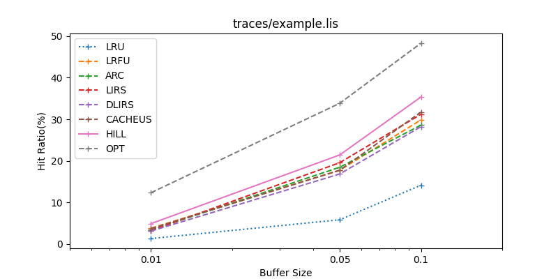

# Hill-Cache
We provide a prototype for Hill-cache and a benchmark for MemHC.

The implementation of MemHC is at https://github.com/liyunfan1223/MemHC

## Prototype

The prototype is used to verify and compare the hit rate performance of the cache polices. We implemented varies cache policies and compared the hit rate difference with hill-cache under the condition of global synchronization cache.

### Build
```
mkdir build
cd build
cmake ..
make proto
```

### Usage
```
./bin/proto -h
Usage: ./proto [options]
Options:
  -h, --help             Show this help message
  -c, --cache-policy     Cache policy (LRU, LFU, ARC, SRRIP, DRRIP, LRFU, LIRS, DLIRS, CACHEUS, HILL, OPT)
  -b, --buffer-size      Buffer size (decimal represents the ratio to the footprint, integer represents the size)
  -t, --trace-file       Trace file path
  -s, --stats-interval   Statistics reporting interval
```

### Example
```
./bin/proto -c HILL -b 0.1 -t ../traces/example.lis -s 50000
Hill-Cache: buffer_size:30994 hit_count:643989 miss_count:1177420 hit_rate:35.3566%
```


### Scripts

**Installation**
```
pip install -r requirement
```
**Runner**
```
python ./scripts/prototype/runner.py
```
**Visualization**



Check output figure in local/runner_example.png

**Configuration**

Check scripts/config.py to configure parameters for prototype running.


## Benchmark